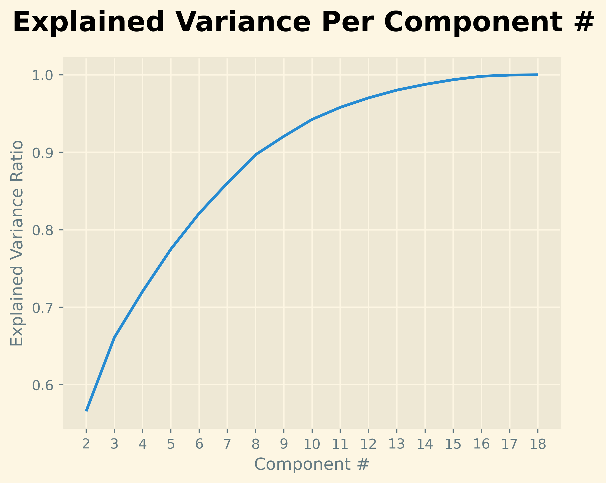
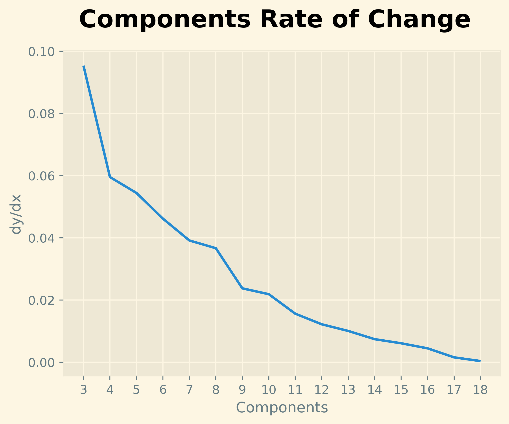
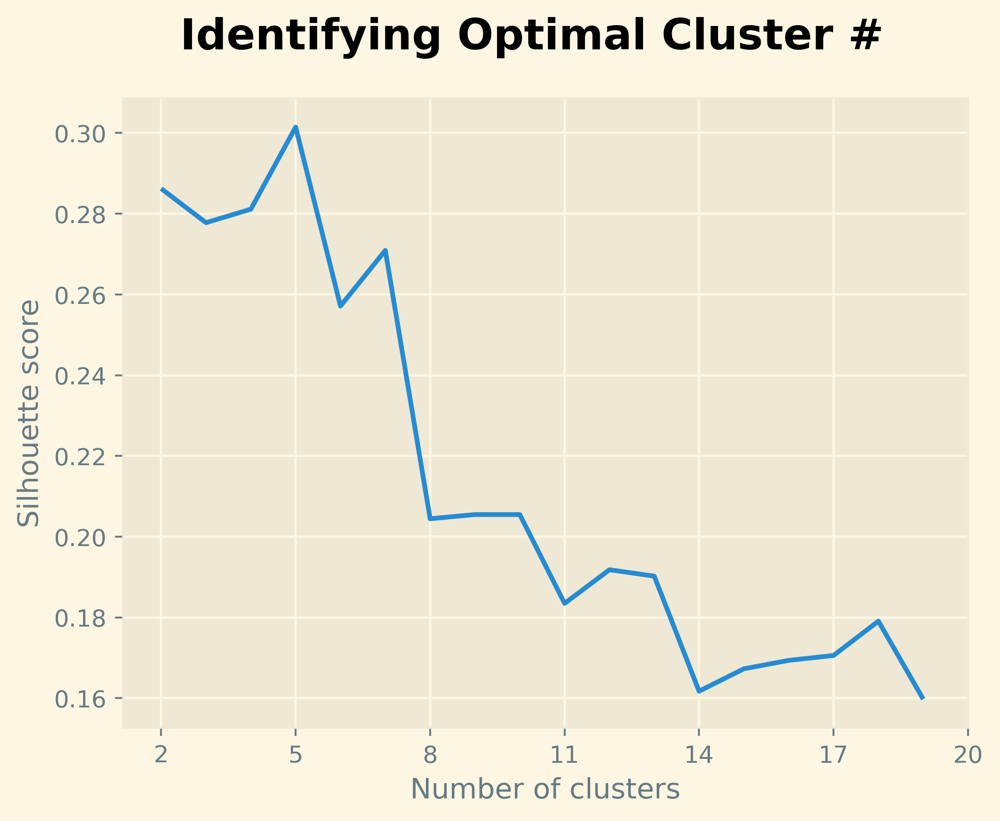

# Prem-Cluster-Project

## Introduction
In this project I wanted to work on utilizing KNN (K-nearest-neighbors) classification to practice clustering. As I am have a passion for sports, especially soccer, I decided to look at some Premier League statistics and try to classify players into different groups of play-styles. In case you don't know, the Premier League is the league in England, which is one of the top soccer leagues in the world! My goal in the project is to use only the players' statistics to be able to cluster them into groups based on how they play and how the impact a game. Once I group the players, I will analyze the different groups and award them names as well as highlight the noteable players in each group. I am only going to focus on forwards (attackers) in this project, since they are the position in which I am most interested in analyzing and the most meaningful data available is related to forwards. Let's get started!

## Acquiring Data and Data Cleaning
### Acquiring Data
I retrieved all of my data from the Premier League Stats page: https://www.premierleague.com/stats . However, getting the data was not as straightforward as downloading some csv files. In order to obtain the data I used in the project, I used the Premier League website API, which allowed me access to retrieve the data in the form of json objects. With the use of a few steps of long python commands, I was able to retrieve all of the data for forwards into a pandas dataframe! I titled this as my base_df, since it is before any cleaning occurs.
### Data Cleaning
The majority of the work with setting this dataset up for analysis was just retrieving it from the web, and figuring out how to retrieve the necessary information from a messy json dictionary. Since we did that in the previous step, all that was left to do was to change the index to the playerId, and fill the null values. In order to fill the null values, I first had to understand what caused null values in this case. 
In other cases, I may have needed a complete other step to do a missing values analysis, and determine whether the data are MCAR, MAR, or NMAR. However, I know this simply from the way that I retrieved the data from the web. Since each stat was on a different page and therefore a different table, I had to merge a lot of different tables to get all the statistics that I wanted to use. Therefore, I used a left merge with the first dataframe I created which had all the data for players that scored goals. So, once I added a new statistic (column) to the base dataframe if the player was not included in the table with the new statistic, then that player's value would be null for that statistic. This means that the null values are MAR dependent on the `goals` column. I deduced that a player is only not included in a table if their value for that statistic is 0, so therefore I was able to assume that all null values can just be changed to 0. So I did exactly that, and changed all null values in the dataframe to 0, concluding the data cleaning process. The dataset is now clean and ready to be used for KNN classification! Here are the first few rows and columns of the dataframe:
<table border="1" class="dataframe"><thead><tr style="text-align: right;"><th></th><th>goals</th><th>goal_assist</th><th>yellow_card</th><th>total_scoring_att</th><th>ontarget_scoring_att</th><th>hit_woodwork</th><th>att_hd_goal</th><th>att_pen_goal</th><th>att_freekick_goal</th><th>total_offside</th></tr><tr><th>name</th><th></th><th></th><th></th><th></th><th></th><th></th><th></th><th></th><th></th><th></th></tr></thead><tbody><tr><th>Mohamed Salah</th><td>27</td><td>17.0</td><td>1.0</td><td>107</td><td>56</td><td>4.0</td><td>0.0</td><td>9.0</td><td>0.0</td><td>12.0</td></tr><tr><th>Erling Haaland</th><td>21</td><td>3.0</td><td>2.0</td><td>102</td><td>58</td><td>4.0</td><td>4.0</td><td>2.0</td><td>0.0</td><td>4.0</td></tr><tr><th>Alexander Isak</th><td>20</td><td>5.0</td><td>1.0</td><td>72</td><td>35</td><td>3.0</td><td>4.0</td><td>2.0</td><td>0.0</td><td>19.0</td></tr><tr><th>Chris Wood</th><td>18</td><td>3.0</td><td>1.0</td><td>53</td><td>32</td><td>0.0</td><td>6.0</td><td>3.0</td><td>0.0</td><td>21.0</td></tr><tr><th>Matheus Cunha</th><td>13</td><td>4.0</td><td>3.0</td><td>86</td><td>35</td><td>1.0</td><td>0.0</td><td>0.0</td><td>0.0</td><td>8.0</td></tr></tbody></table>

## Clustering
### Determine Best Number of Components
The first step in the clustering process is to determine the best number of components to use from the features that finds the right balance between an expected variance ratio closer to 1 and not overfitting. To determine this number, we must conduct an analysis using our data.
#### Step One: Standardize Data
Our first step in this process is to use the SKlearn StandardScaler preprocessor to standardize our data within each statistic/column. Here is the code I used to accomplish this:
```
df_features = list(df.columns)
X = df.loc[: , df_features].values
X = StandardScaler().fit_transform(X)
```
Now, X is an array with each element being a list that contains all the standardized values for a specific feature. The reason that this step is necessary instead of just using the original data, is that standardizing the data puts all the features on the same scale so that our analysis and SKlearn machine learning processes can work more accurately.
#### Step 2: Find Variance for Different Components
Now that we have standardized our data, we want to find the variance for different number of components. In this context, a good variance value is one that is somewhat close to 1, because our "explained variance ratio" indicates the proportion of total variance represented by that number of components. Therefore, we want to find a component number that is close to 1, but once the increase in variance between components barely changes, then adding more components doesn't help too much. So we want to find the number of components right in the sweet spot.

To accomplish this task, we are using the Principal Component Analysis (PCA) capabilities from the SKlearn decomposition module which gives us the variance for each number of components when fit to our data. **If you are interested in what exactly the PCA is you can check out the documentation page: https://scikit-learn.org/stable/modules/generated/sklearn.decomposition.PCA.html**. 

Moving on, for each number of components ((2-18) since we have 18 statistics), we create a PCA object with n number of components and fit our data to the object, and transform it. Once the data is transformed, we can use PCA operations to access the variance for each number of components! Plotting the variance per component, we get a graph like this:



#### Step 3: Analyze Change in Variance, Make Decision
It is hard to determine the best component simply from this graph, so I also created a plot displaying the difference in variance from component to component. This allows us to see the last areas where the increase in variance is still substantial, which is our key to selecting the component number. This is what that plot looks like:



From this graph, using the common elbow method, we can see that at n=10, there is still one more solid change in variance, and then begins to flatten out past that. If we look at our variance values, we see that at n_components=10, the explained variance ratio is 0.942406892839495, with a change in variance of about 0.02 from 9 components. After n_components=10, the change in variance values are all around 0.01 or below. Therefore, we can settle for a variance of 0.94 which is very solid, since adding more components will likely only hurt our model.

#### Step 4: Transform Our Data with PCA Using Best Component Value
From this variance analysis using PCA, we were able to conclude that a good number of components to use is 10! This does not necessarily mean that 10 was the only value we could use, but based on my judgement it is the most ideal number to use. We now create a PCA object with n_components=10 and fit it to our data add transform the data. We then add our PCA values to a dataframe named pca_df to use for our clustering process in the next step.

### Determine Best Number of Clusters
#### Step 1: Declare PCA Object
Our first step to achieving our optimal cluster number is to declare a PCA object on our optimal number of components we determined in the last section: n-components=10. We then fit it to our standardized data and transform it, then assiging it to a dataframe. The code to accomplish this looks like this:
```
pca = PCA(n_components=10)
components = pca.fit_transform(X)
pca_df = pd.DataFrame(components, columns=column_list)
pca_df.insert(0, 'Player', df.index)
```
This simple code gives us a dataframe title `pca_df` that looks like this (first few rows), where each column represents a PCA component:
<table border="1" class="dataframe"><thead><tr style="text-align: right;"><th></th><th>Player</th><th>PC 1</th><th>PC 2</th><th>PC 3</th><th>PC 4</th><th>PC 5</th><th>PC 6</th><th>PC 7</th><th>PC 8</th><th>PC 9</th><th>PC 10</th></tr></thead><tbody><tr><th>0</th><td>Mohamed Salah</td><td>9.350887</td><td>2.706413</td><td>-5.080035</td><td>2.323063</td><td>-3.219928</td><td>-1.438530</td><td>1.976336</td><td>0.054462</td><td>-1.274589</td><td>1.200886</td></tr><tr><th>1</th><td>Erling Haaland</td><td>3.703837</td><td>5.414055</td><td>-0.685074</td><td>0.369525</td><td>0.279154</td><td>-0.583478</td><td>-0.960898</td><td>-2.341696</td><td>0.904995</td><td>-2.137506</td></tr><tr><th>2</th><td>Alexander Isak</td><td>3.714020</td><td>4.295657</td><td>-1.159028</td><td>-0.443460</td><td>0.077417</td><td>-0.507819</td><td>-1.224488</td><td>-0.435646</td><td>0.263161</td><td>0.102821</td></tr><tr><th>3</th><td>Chris Wood</td><td>2.133712</td><td>6.358634</td><td>0.027517</td><td>-2.339769</td><td>1.947023</td><td>-2.119763</td><td>0.377086</td><td>0.310802</td><td>0.525561</td><td>0.576193</td></tr><tr><th>4</th><td>Matheus Cunha</td><td>5.627382</td><td>-2.978258</td><td>-0.827876</td><td>-1.287034</td><td>1.531212</td><td>0.113383</td><td>-0.372820</td><td>0.461905</td><td>-0.529903</td><td>-2.279014</td></tr></tbody></table>

##### PCA Explanation
While the code is simple, the acutal PCA computation is quite complex, as it carries out what is called "dimensionality reduction", which transforms our original data into a lower-dimensional representation, preserving only the most important information. It creates a principal component by combining the original variables in ways that maximize the explained variance! Additionally, each principal component is orthogonal to each other, which means they are all linearly independent which prevents any redundant components. Overall, what PCA is accomplishing is it is actually transforming the original data into a new coordinate system where each axis is a principal component, ordered by variance. It is essentially combining components to maximize the variance explained, so that we can represent the data in a more efficient way!

#### Step 2: Find Silhoutte Score for Different Number of Clusters
First, we convert the component columns of our `pca_df` into a numpy column stack. We then need to find a score for different number of clusters fit on our data. For determining clusters we will use Sklearn's KMeans algorithm, and for determing the score of those clusters we will be using their silhoutte score. To accomplish this we build a for loop where we create n_clusters using KMeans and then find the sihloutte score of that clustering, for 2-19 clusters. We can then plot our sihloutte scores to analyze our cluster numbers: 

#### Step 3: Determine Ideal Number of Clusters
There are many ways to interpret this graph, but for our purposes we are just going to choose the cluster number with the highest silhouette score: 5 clusters! I actually tried using other n_cluster values I determined from different methods for the cluster number used for the final clustering of the players, but I realized that there wasn't a need for so many clusters given that the dataset is relatively small. Therefore, 5 clusters is the perfect amount for analysis, as it is rather small and has the best silhouette score we found!

### Create Clusters
The final step of the clustering process is to create the clusters using our best determined number of clusters! Accomplishing this is very simple; we just use SKlearn's KMeans algorithm using 5 as our n_clusters and fit it to our data and use that to predict the clusters for our players! Our code to accomplish this and turn our predictions into a dataframe looks like this:
```
kmeans = KMeans(n_clusters=5, random_state=1)
kmeans.fit(x)
y_kmeans = kmeans.predict(x)
df_cluster = pd.DataFrame()
df_cluster['Player'] = df.index
df_cluster['Cluster'] = y_kmeans
```
Now we have a dataframe called df_cluster that has each forward in the premier league and which cluster they belong to! The first few rows look like this:
<table border="1" class="dataframe"><thead><tr style="text-align: right;"><th></th><th>Player</th><th>Cluster</th></tr></thead><tbody><tr><th>0</th><td>Mohamed Salah</td><td>2</td></tr><tr><th>1</th><td>Erling Haaland</td><td>1</td></tr><tr><th>2</th><td>Alexander Isak</td><td>1</td></tr><tr><th>3</th><td>Chris Wood</td><td>1</td></tr><tr><th>4</th><td>Matheus Cunha</td><td>2</td></tr></tbody></table>

As we can see, Haaland and Isak are in the same cluster and Salah and Cunha are in the same cluster which makes sense to me! Looking through all the clusters they make a lot of sense, so we did a good job of choosing appropriate numbers of components and clusters. Super cool!

### Conclusion
Now that we've created our clusters, the next step is up to my own soccer knowledge! I have to determine the type of players that end up in each cluster using both statistics and what I've seen of the players. I will name each category based on the player traits and playstyle and display advanced statistics for each group!
